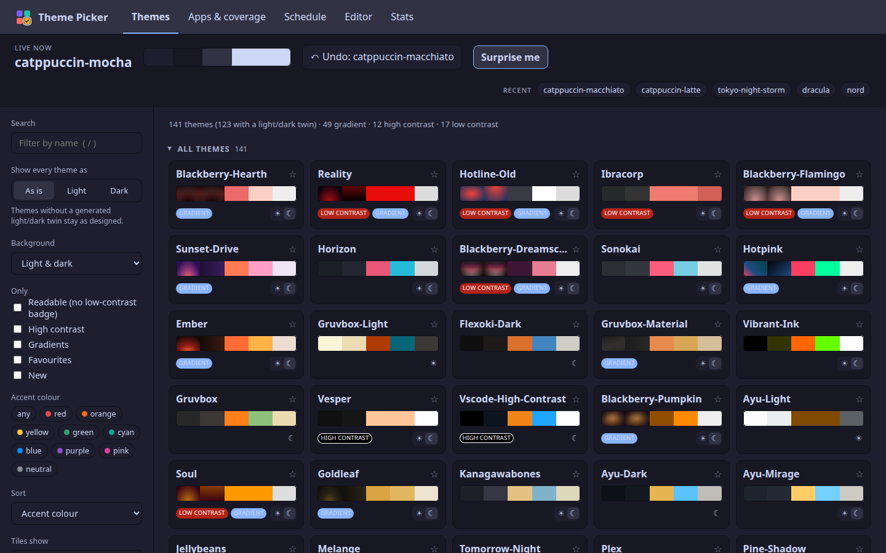
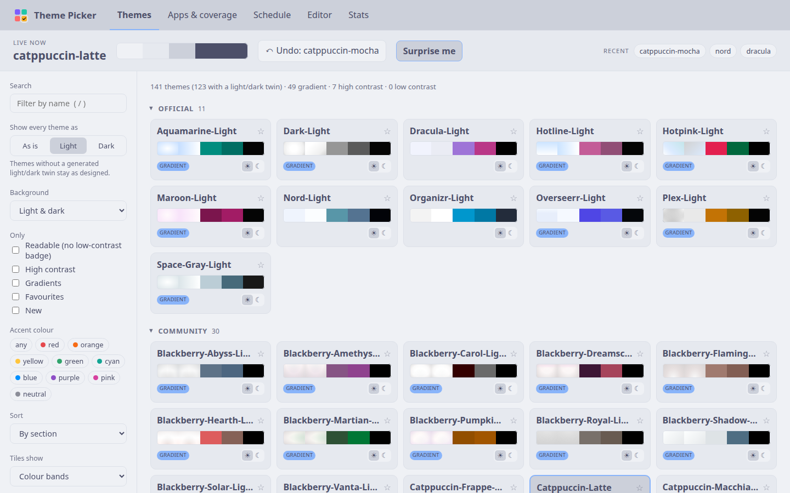
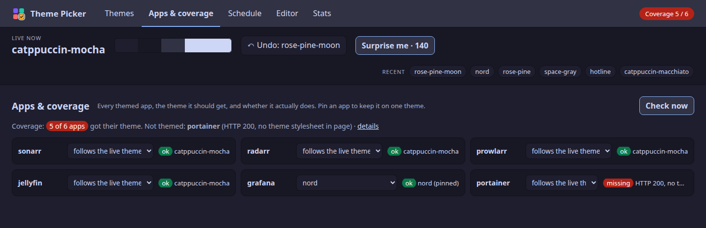
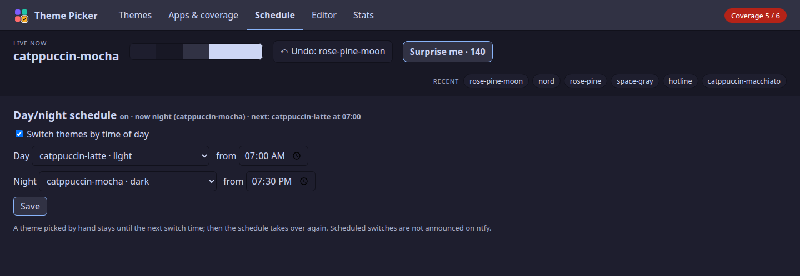
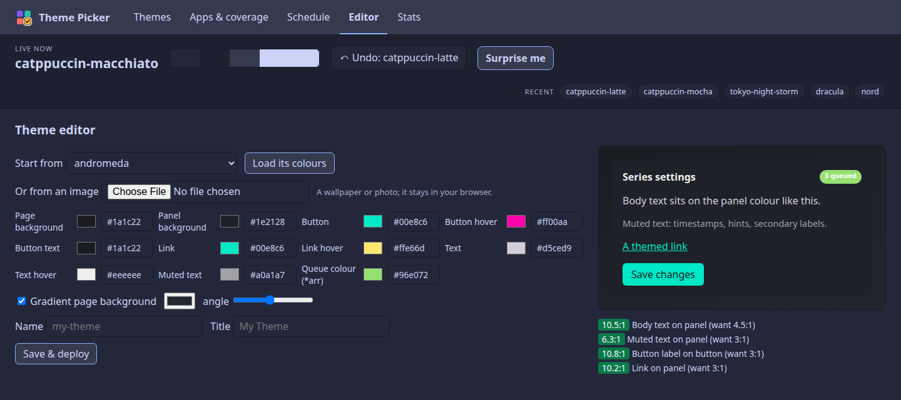
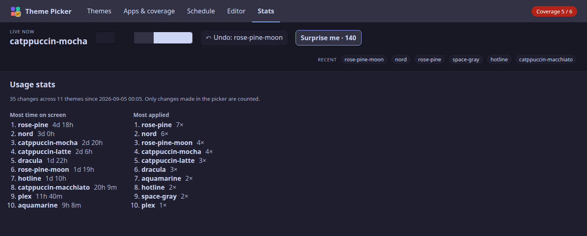

# Theme Picker

A web UI for switching a self-hosted [theme.park](https://theme-park.dev) theme
across every app behind Traefik at once — with live previews, real screenshots,
a contrast audit, per-app pins and an in-browser theme editor.

*Sorted by accent colour. Any sort other than the default "By section" merges
Official, Community and Custom into one "All themes" list.*

> **Status: early.** It needs Traefik with its file provider and the
> [`traefik-themepark`](https://github.com/packruler/traefik-themepark) plugin;
> it writes the plugin's middleware config itself. Official and community
> themes work out of the box. Custom themes and the in-browser editor still
> depend on a companion pipeline that isn't in this repository yet.
>
> **[Deployment guide → DEPLOY.md](DEPLOY.md)**. Every setting is documented
> in `picker.example.yml`.

## Features

- Every official, community and custom theme as a tile with a colour-band
  preview, or a real screenshot of any app in that theme
- Filters (name, light/dark, gradient, readable, high contrast, new,
  favourites, accent colour), sorting, keyboard navigation, "surprise me"
- Contrast audit on every theme: *low contrast* and *high contrast* (WCAG AAA
  for every text role) badges, measured rather than claimed
- Lightbox of real screenshots per theme, captured by a headless-Chrome job
- Recent-theme history chips and usage stats
- Per-app theme pins, with a coverage check that every app actually received
  the theme it should
- In-browser theme editor with live preview and contrast readout; saved themes
  are committed and deployed automatically
- ntfy notifications (debounced) and a JSON endpoint for dashboard widgets
- Homepage and Glance take on the live theme too, via stylesheets the picker
  serves
- Start a theme from any image (colours extracted in the browser)
- A token-protected hook so Home Assistant or any automation can set the theme
- Day/night schedule, undo, side-by-side screenshot compare

## A tour of the tabs

Every tab shares the header strip:
- the live theme and its colours
- **Undo**, which puts back the previous theme
- **Surprise me · N**, which applies a random theme from the N that the
  current filters show
- the most recent themes, one click each

The picker wears the live theme itself.

### Themes

Every official, community and custom theme is a tile with a colour-band
preview. The sidebar narrows the list:
- search
- light or dark background
- readable only, high contrast, gradients, favourites, new
- accent colour

It also sorts the list by section, name, lightness, accent colour or date
added. Click a tile to apply it everywhere. The ☀/☾ switch on a tile flips
that theme between its original and its generated light or dark twin.

*Show every theme as* **Light** or **Dark** flips every theme at once. Here
it is set to **Light** in Catppuccin Latte:

Badges come from a real contrast audit of each theme's CSS:
- **low contrast**: body text under 4.5:1, or muted text or button labels
  under 3:1.
- **high contrast**: every text role at WCAG AAA, 7:1.

### Apps & coverage

Every themed app, the theme it should get, and whether it actually gets it.
The check requests each app's page the way a browser would and reads which
stylesheet was injected, so a router that lost its middleware shows up as
**missing**. It runs on a schedule too and can alert through ntfy. Pin an
app to keep it on one theme whatever the live theme is; Grafana is pinned
to Nord here.

*Sample apps and sample coverage results.*

### Schedule

A day theme and a night theme, switched at the times you set. A theme picked
by hand holds until the next switch, then the schedule takes over again.

### Editor

Build a theme from any existing one, or from an image. The colours are
extracted in the browser and the image never leaves it. The preview panel
updates as you edit, with a contrast ratio for each text role against its
target. *Save & deploy* hands the theme to a host-side job that verifies it,
commits it and deploys it. See [DEPLOY.md](DEPLOY.md#not-portable-yet) for
what that needs.

### Stats

Which themes spent the most time on screen and which were applied most,
counted from changes made in the picker.

*Sample three-week history.*

## License

[MIT](LICENSE)
