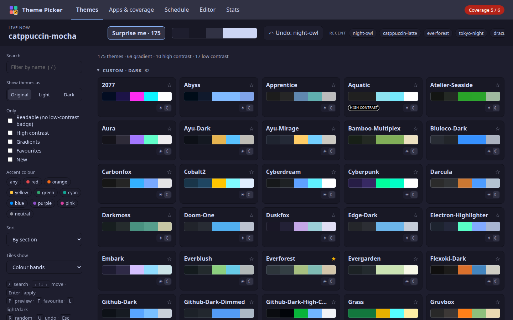
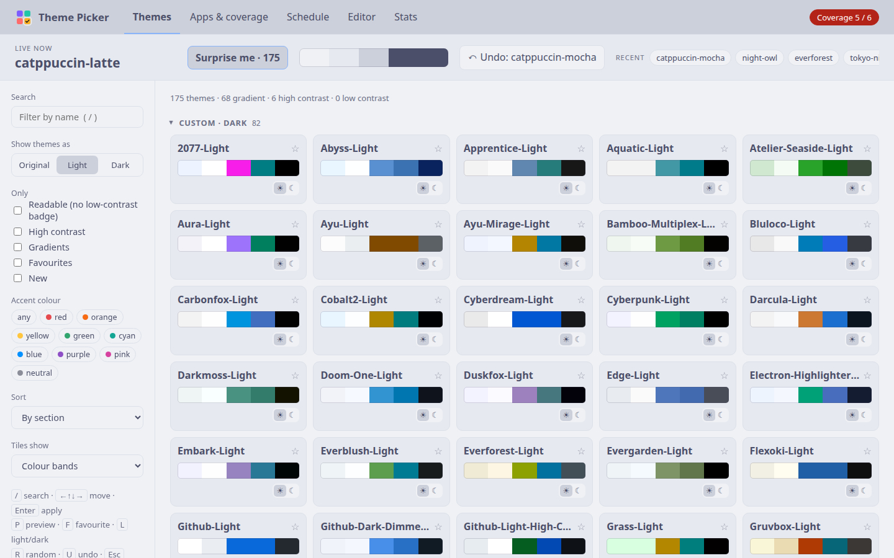
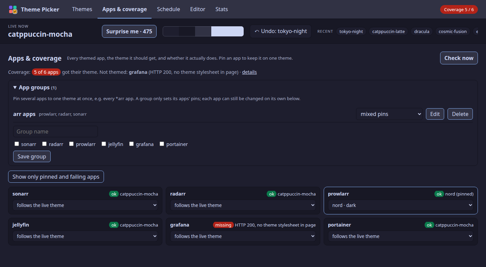
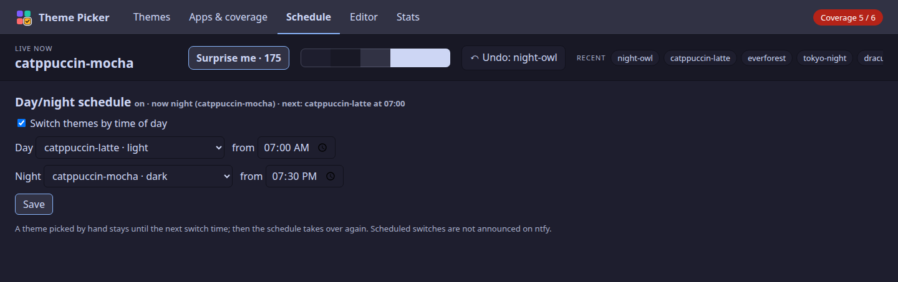
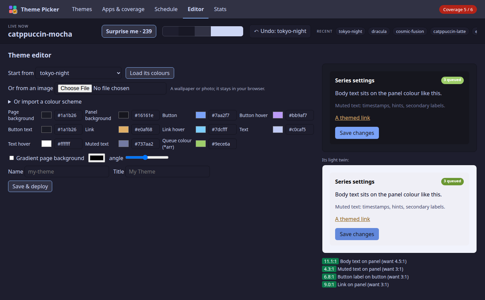
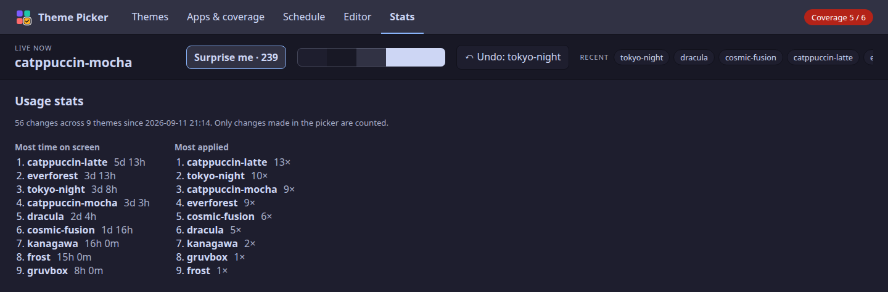

# Theme Picker

A web UI for switching a self-hosted [theme.park](https://theme-park.dev) theme
across every app behind Traefik at once — with live previews, real screenshots,
a contrast audit, per-app pins and an in-browser theme editor.



*Hand-made themes come first, in foldable groups (dark, light, gradients, made
in the editor), then theme.park's Community and Official themes. Any sort other
than "By section" pools them into one list.*

> **Requirements:** Traefik with its file provider and the
> [`traefik-themepark`](https://github.com/packruler/traefik-themepark) plugin;
> the picker writes the plugin's middleware config itself. Official and
> community themes work out of the box. It can also deploy your own themes
> into a self-hosted theme.park: 153 are ready-made, each in light and dark,
> in [theme-park-themes](https://github.com/prophetizer/theme-park-themes).

## Install

**Just want to try it?** The [starter stack](starter/) runs Traefik,
theme.park, the picker and a demo app on `http://*.localhost` with one
`docker compose up -d`.

The image is published for linux/amd64 and linux/arm64:

```bash
docker pull ghcr.io/prophetizer/theme-picker:1
```

Tags: `1.0.0` (exact release), `1.0` and `1` (latest patch or minor of that
line), `latest`. Pin `1` to get fixes without breaking changes.

It runs as a non-root user, listens on port 8090, and keeps its config and
state in `/data`. Put it behind your reverse proxy's authentication rather
than publishing the port. The **[deployment guide → DEPLOY.md](DEPLOY.md)**
has the full compose example and Traefik wiring; every setting is documented
in [`picker.example.yml`](picker.example.yml).

## Features

- Every official, community and custom theme as a tile with a colour-band
  preview, or a real screenshot of any app in that theme
- Filters (name, light/dark, gradient, readable, high contrast, new,
  favourites, accent colour), sorting, keyboard navigation, "surprise me"
- Contrast audit on every theme: *low contrast* and *high contrast* (WCAG AAA
  for every text role) badges, measured rather than claimed
- Lightbox of real screenshots per theme, captured by a headless-Chrome job
- Recent-theme history chips and usage stats
- Per-app theme pins, with a coverage check that every app actually received
  the theme it should
- In-browser theme editor with live preview and contrast readout; saved themes
  are committed and deployed automatically
- ntfy notifications (debounced) and a JSON endpoint for dashboard widgets
- Homepage and Glance take on the live theme too, via stylesheets the picker
  serves
- Start a theme from any image (colours extracted in the browser)
- A token-protected hook so Home Assistant or any automation can set the theme
- Day/night schedule, undo, side-by-side screenshot compare

## A tour of the tabs

Every tab shares the header strip:
- the live theme and its colours
- **Undo**, which puts back the previous theme
- **Surprise me · N**, which applies a random theme from the N that the
  current filters show
- the most recent themes, one click each

The picker wears the live theme itself.

### Themes

Every official, community and custom theme is a tile with a colour-band
preview, and every one comes in a light and a dark form. The sidebar narrows
the list:
- search
- readable only, high contrast, gradients, favourites, new
- **closest to a colour**: pick any colour and the themes that use it come first
- hidden themes: **hide** a theme you never want (in its preview, or **H**) and
  it leaves the grid, Surprise me and the theme of the day; "Show hidden
  themes" brings them back

A theme's preview also lists the five themes that **look most like it**.
- accent colour

It also sorts the list by section, name, lightness, accent colour or date
added. Click a tile to apply it everywhere. The ☀/☾ switch on a tile flips
that theme between its light and dark form: the author's own where they made
both, otherwise a generated twin.

*Show themes as* **Light** or **Dark** flips every theme at once. Here it is
set to **Light** in Catppuccin Latte:



Badges come from a real contrast audit of each theme's CSS:
- **low contrast**: body text under 4.5:1, or muted text or button labels
  under 3:1.
- **high contrast**: every text role at WCAG AAA, 7:1.

### Apps & coverage

Every themed app, the theme it should get, and whether it actually gets it.
The check requests each app's page the way a browser would and reads which
stylesheet was injected, so a router that lost its middleware shows up as
**missing**. It runs on a schedule too and can alert through ntfy. Pin an
app to keep it on one theme whatever the live theme is. Apps that are fine
and follow the live theme fold behind one button, so pinned and failing ones
stand out; here the list is unfolded, Prowlarr is pinned to Nord and Grafana
is missing its theme.



*Sample apps and sample coverage results.*

### Schedule

A day theme and a night theme, switched at the times you set. A theme picked
by hand holds until the next switch, then the schedule takes over again.

Or a **theme of the day**: a random pick every morning, from your favourites
or from every theme, never a hidden one. One schedule runs at a time.



### Editor

Build a theme from any existing one, from an image, or by **importing a colour
scheme**: paste a base16/base24 YAML, a Ghostty, Kitty, Alacritty, Xresources or
Windows Terminal scheme, an iTerm2 `.itermcolors` file or a VS Code theme, and it
is mapped onto the fields and made readable. Everything is parsed in the browser.
The preview updates as you edit, with a contrast ratio for each text role, and a
second preview shows the theme's **light or dark twin**.

From any theme's preview, **Edit a copy** opens its colours in the editor, and
on a low-contrast theme **Make a readable copy** opens a copy with every text
role brought to 7:1 (body) or 4.5:1, moving only lightness (and darkening the
page where no text colour could otherwise reach it).

*Save & deploy* adds it to your custom themes and deploys it to theme.park. See
[DEPLOY.md](DEPLOY.md#custom-themes).



### Stats

Which themes spent the most time on screen and which were applied most,
counted from changes made in the picker.



*Sample three-week history.*

## License

[MIT](LICENSE)
